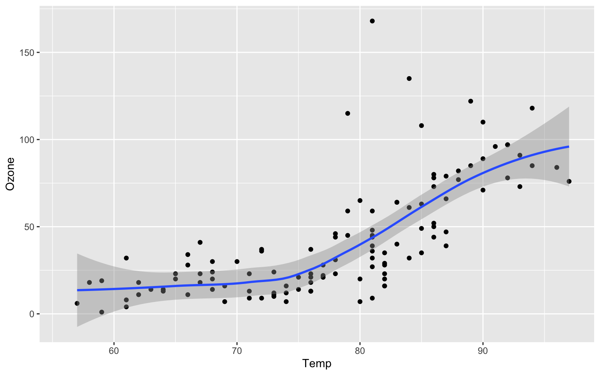

-   [Air Quality](#air-quality)

## Air Quality

[Figure 1](#fig-airquality) further explores the impact of temperature on ozone level.

<details>
<summary>Code</summary>

``` r
library(ggplot2)

ggplot(airquality, aes(Temp, Ozone)) + 
  geom_point() + 
  geom_smooth(method = "loess"
)
```

</details>


